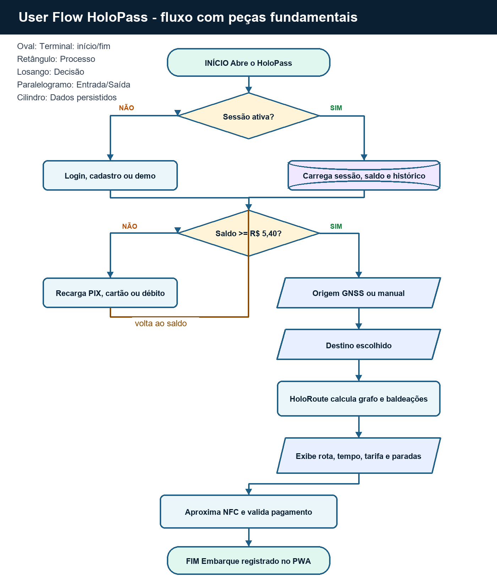

# HoloPass - Software & Total Experience Design

**Global Solution 2026 - Indústria Espacial - FIAP**
**Equipe:** Thiago Souza de Lima - RM 568732

## 1. Sumário Executivo

O HoloPass é uma pulseira inteligente para transporte público urbano. Ela une
pagamento por NFC, localização por GNSS, planejamento de rota operacional e PWA
offline para reduzir filas, insegurança, dependência do celular e falta de
informação durante deslocamentos.

O projeto existe como sistema integrado: app web em HTML/CSS/JS puro, landing
page, firmware Arduino, programa Python de menu, modelo matemático GNSS e
documentação de pitch. Cada disciplina entrega uma camada da mesma solução.

## 2. Problema Real

Passageiros enfrentam catracas lentas, saldo pouco visível, celulares expostos em
estações lotadas e informação limitada sobre rota, baldeação e chegada. Pessoas
com menor acesso a smartphone ou dados móveis sofrem mais, ampliando a desigualdade
de mobilidade.

O custo aparece em tempo perdido, risco de furto, atraso operacional e menor
confiança no transporte público. A solução importa porque a mobilidade previsível
melhora o acesso a estudo, trabalho, saúde e lazer.

## 3. Solução Tecnológica

O HoloPass propõe uma pulseira com display, NFC, vibração e leitura GNSS. O app
demonstra autenticação, saldo, recarga, histórico, rotas, pagamento, modo offline,
HoloRoute determinístico, próximo trem real quando a API cobre a estação e
diagnóstico urbano com OpenStreetMap/Overpass e GTFS SPTrans local.

O HoloRoute substitui recursos pouco relevantes por uma decisão explicável: monta
a malha metroferroviária como grafo de estações, linhas e corredores de
transferência. A rota Osasco -> Trianon-MASP, por exemplo, passa pela Linha 9,
faz transferência em Pinheiros para a Linha 4, segue pela transferência
Paulista/Consolação para a Linha 2 e chega à estação Trianon-MASP.

No site principal, a antiga vitrine visual foi substituída por um painel
operacional com diagnóstico GNSS real pelo navegador, catraca NFC simulada,
histórico de validações e métricas de operação da viagem.

## 4. Conexão com a Indústria Espacial

A conexão espacial é direta por GNSS: o sistema usa latitude, longitude, precisão
em metros e Haversine para identificar a estação mais próxima. A camada de
cobertura urbana usa OpenStreetMap/Overpass para localizar estações reais e GTFS
SPTrans para contar paradas de ônibus no raio consultado dentro da cobertura
municipal de São Paulo. CBERS-4A/Amazonia-1 entram como contexto de Observação da
Terra, sem inventar imagem satelital real.

## 5. Arquitetura Integrada

| Camada | Entrega | Papel no sistema |
|---|---|---|
| Software/TXD | Este documento | Define problema, visão, arquitetura, backlog e fluxo |
| Front-End Design | Landing page | Comunica problema, tecnologia, objetivos, público e benefícios |
| Web Development | PWA principal | Protótipo funcional de login, recarga, rota, NFC, GNSS, quiz e feedback |
| Edge Computing | Arduino | Simula a pulseira física com GNSS, NFC, LED, buzzer e telemetria |
| Computational Thinking | Python menu | Demonstra lógica de usuário, saldo, rota, histórico e validação |
| DPS | Modelo GNSS | Explica matemática espacial com funções e gráficos |
| Storytelling | Pitch | Apresenta narrativa, proposta de valor, tecnologia e equipe |

## 6. Viabilidade Técnica

A versão educacional usa simulações honestas para o que depende de hardware real:
GNSS e NFC no Arduino são simulados, mas a matemática e as decisões locais são
reais. A pulseira física poderia ser prototipada com ESP32/Arduino, módulo
RFID/NFC, display OLED, motor de vibração e bateria.

O app web não depende de frameworks. O PWA funciona offline via service worker. O
próximo trem usa API pública da ViaMobilidade em estações cobertas; fora disso,
o sistema mostra fallback documentado. Uma versão de produção precisaria integrar
dados oficiais, homologação de pagamento e segurança embarcada.

## 7. Impacto e ODS

- **ODS 9 - Inovação e infraestrutura:** integra software, dispositivo físico e
  dados de localização para modernizar o transporte.
- **ODS 10 - Redução de desigualdades:** reduz dependência de smartphone e dados
  móveis durante a viagem.
- **ODS 11 - Cidades inteligentes:** melhora previsibilidade, conexão entre
  linhas e priorização conceitual de áreas mal atendidas.
- **ODS 13 - Ação climática:** apoia transporte coletivo mais atrativo, reduzindo
  dependência de deslocamentos individuais.

## 8. Declaração da Visão do Produto

Para passageiros urbanos que precisam viajar com segurança, previsibilidade e
menos dependência do celular, o HoloPass é uma pulseira de transporte inteligente
que combina pagamento NFC, localização GNSS, rota operacional e alertas físicos.
Diferente de um bilhete comum, ele integra pagamento, posição, histórico e
planejamento urbano em uma experiência única e acessível.

## 9. Backlog Priorizado

| ID | História | Prioridade | Critério de aceite |
|---|---|---|---|
| US01 | Como passageiro, quero pagar por NFC para embarcar sem tirar celular/cartão do bolso. | Alta | Pagamento debita saldo e registra histórico. |
| US02 | Como passageiro, quero recarregar por PIX, cartão ou débito para manter saldo ativo. | Alta | Valores de R$ 20, R$ 50 ou R$ 100 atualizam saldo. |
| US03 | Como passageiro, quero detectar estação por GNSS para iniciar a rota com menos cliques. | Alta | App mostra estação mais próxima e precisão. |
| US04 | Como passageiro, quero calcular rota com baldeações reais para planejar meu trajeto. | Alta | Rota exibe linhas, paradas, tempo, tarifa e timeline. |
| US05 | Como passageiro, quero ver saldo, histórico e estatísticas para controlar gastos. | Média | Painel atualiza após recarga ou pagamento. |
| US06 | Como usuário com internet instável, quero PWA offline para acessar dados essenciais. | Média | Service worker mantém app aberto sem rede. |
| US07 | Como operador público, quero mapa de calor conceitual para priorizar áreas carentes. | Média | Hotspots mostram diagnóstico e prioridade. |
| US08 | Como passageiro em horário cheio, quero recomendação HoloRoute explicável. | Média | Painel mostra risco, lotação e recomendação sem prometer API real. |
| US09 | Como avaliador, quero evidências técnicas para comprovar funcionamento. | Alta | Relatório lista comando, resultado e pendências. |

## 10. User Flow

O fluxo abaixo usa peças fundamentais de fluxograma: terminal para início/fim,
retângulo para processo, losango para decisão, paralelogramo para entrada/saída
e cilindro para dados persistidos.

**Legenda dos símbolos**

| Símbolo | Peça de fluxograma | Uso no HoloPass |
|---|---|---|
| Oval | Terminal | Início e fim da jornada |
| Retângulo | Processo | Login, recarga, cálculo de rota e validação NFC |
| Losango | Decisão | Sessão ativa, saldo suficiente e pagamento aprovado |
| Paralelogramo | Entrada/Saída | Origem GNSS/manual, destino e exibição de rota |
| Cilindro | Dados | Sessão, saldo, histórico e cache offline |

**Sequência do usuário**

1. Início: passageiro abre o HoloPass.
2. Decisão: existe sessão ativa?
3. Se não existir, o usuário faz login, cadastro ou entra no modo demo.
4. O sistema carrega painel, saldo, histórico e cache local.
5. Decisão: saldo é suficiente para a tarifa de R$ 5,40?
6. Se não for suficiente, o usuário recarrega por PIX, cartão ou débito.
7. Entrada: usuário detecta origem por GNSS ou escolhe manualmente.
8. Entrada: usuário seleciona o destino.
9. Processo: HoloRoute calcula grafo de linhas, estações e baldeações.
10. Saída: app exibe tempo, tarifa, paradas, baldeações e rota visual.
11. Processo: usuário aproxima a pulseira NFC na catraca simulada.
12. Decisão: pagamento aprovado?
13. Se aprovado, o sistema atualiza saldo, histórico e estatísticas.
14. Dados: PWA salva informações essenciais para uso offline.
15. Fim: passageiro embarca com rota e comprovação registradas.

## 11. Critérios de Aceite

- App sem erros de console nos fluxos principais.
- Rota Osasco -> Trianon-MASP usa Linha 9 -> Linha 4 -> Linha 2.
- Distância exibida e rotulada como operacional estimada por trechos da rede.
- Nenhuma promessa técnica sem evidência ou API real não comprovada.
- Edge compila e demonstra LED, buzzer, NFC, saldo e telemetria.
- CT Python usa conceitos obrigatórios e não depende de pacote externo.
- Toda imagem local usada no app possui texto alternativo.
- Pendências externas ficam separadas: vídeo, Wokwi público e organização GitHub.
