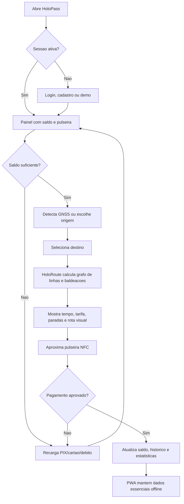

# HoloPass - Software & Total Experience Design

**Global Solution 2026 - Industria Espacial - FIAP**  
**Equipe:** Thiago Souza de Lima - RM 568732

## 1. Sumario Executivo

O HoloPass e uma pulseira inteligente para transporte publico urbano. Ela une
pagamento por NFC, localizacao por GNSS, planejamento de rota operacional e PWA
offline para reduzir filas, inseguranca, dependencia do celular e falta de
informacao durante deslocamentos.

O projeto existe como sistema integrado: app web em HTML/CSS/JS puro, landing
page, firmware Arduino, programa Python de menu, modelo matematico GNSS e
documentacao de pitch. Cada disciplina entrega uma camada da mesma solucao.

## 2. Problema Real

Passageiros enfrentam catracas lentas, saldo pouco visivel, celulares expostos em
estacoes lotadas e informacao limitada sobre rota, baldeacao e chegada. Pessoas
com menor acesso a smartphone/dados moveis sofrem mais, ampliando desigualdade
de mobilidade.

O custo aparece em tempo perdido, risco de furto, atraso operacional e menor
confianca no transporte publico. A solucao importa porque mobilidade previsivel
melhora acesso a estudo, trabalho, saude e lazer.

## 3. Solucao Tecnologica

O HoloPass propoe uma pulseira com display, NFC, vibracao e leitura GNSS. O app
demonstra autenticacao, saldo, recarga, historico, rotas, pagamento, modo
offline, HoloRoute deterministico e mapa de calor conceitual de areas mal
atendidas.

O HoloRoute substitui recursos antigos pouco relevantes por uma decisao explicavel:
monta a malha metroferroviaria como grafo de estacoes, linhas e corredores de
transferencia. A rota Osasco -> Trianon-MASP, por exemplo, passa por Linha 9,
transferencia em Pinheiros para Linha 4, transferencia Paulista/Consolacao para
Linha 2 e chegada em Trianon-MASP.

## 4. Conexao com a Industria Espacial

A conexao espacial e direta por GNSS: o sistema usa latitude/longitude,
precisao em metros e Haversine para identificar a estacao mais proxima. A camada
de Observacao da Terra usa CBERS-4A/Amazonia-1 como referencia conceitual para
planejamento urbano, sempre rotulada como demonstrativa e sem inventar dado
satelital real.

## 5. Arquitetura Integrada

| Camada | Entrega | Papel no sistema |
|---|---|---|
| Software/TXD | Este documento | Define problema, visao, arquitetura, backlog e fluxo |
| Front-End Design | Landing page | Comunica problema, tecnologia, objetivos, publico e beneficios |
| Web Development | PWA principal | Prototipo funcional de login, recarga, rota, NFC, GNSS, quiz e feedback |
| Edge Computing | Arduino | Simula a pulseira fisica com GNSS, NFC, LED, buzzer e telemetria |
| Computational Thinking | Python menu | Demonstra logica de usuario, saldo, rota, historico e validacao |
| DPS | Modelo GNSS | Explica matematica espacial com funcoes e graficos |
| Storytelling | Pitch | Apresenta narrativa, proposta de valor, tecnologia e equipe |

## 6. Viabilidade Tecnica

A versao educacional usa simulacoes honestas para o que depende de hardware real:
GNSS e NFC no Arduino sao simulados, mas a matematica e as decisoes locais sao
reais. A pulseira fisica poderia ser prototipada com ESP32/Arduino, modulo
RFID/NFC, display OLED, motor de vibracao e bateria.

O app web nao depende de frameworks. O PWA pode funcionar offline via service
worker. O contador de proximo trem e a lotacao sao estimativas locais, nao API
operacional real. Uma versao de producao precisaria integrar dados oficiais de
operacao e seguranca de pagamento homologada.

## 7. Impacto e ODS

- **ODS 9 - Inovacao e infraestrutura:** integra software, dispositivo fisico e
  dados de localizacao para modernizar o transporte.
- **ODS 10 - Reducao de desigualdades:** reduz dependencia de smartphone e dados
  moveis durante a viagem.
- **ODS 11 - Cidades inteligentes:** melhora previsibilidade, conexao entre
  linhas e priorizacao conceitual de areas mal atendidas.
- **ODS 13 - Acao climatica:** apoia transporte coletivo mais atrativo, reduzindo
  dependencia de deslocamentos individuais.

## 8. Declaracao da Visao do Produto

Para passageiros urbanos que precisam viajar com seguranca, previsibilidade e
menos dependencia do celular, o HoloPass e uma pulseira de transporte inteligente
que combina pagamento NFC, localizacao GNSS, rota operacional e alertas fisicos.
Diferente de um bilhete comum, ele integra pagamento, posicao, historico e
planejamento urbano em uma experiencia unica e acessivel.

## 9. Backlog Priorizado

| ID | Historia | Prioridade | Criterio de aceite |
|---|---|---|---|
| US01 | Como passageiro, quero pagar por NFC para embarcar sem tirar celular/cartao do bolso. | Alta | pagamento debita saldo e registra historico |
| US02 | Como passageiro, quero recarregar por PIX/cartao/debito para manter saldo ativo. | Alta | valores R$20/50/100 atualizam saldo |
| US03 | Como passageiro, quero detectar estacao por GNSS para iniciar a rota com menos cliques. | Alta | app mostra estacao mais proxima e precisao |
| US04 | Como passageiro, quero calcular rota com baldeacoes reais para planejar meu trajeto. | Alta | rota exibe linhas, paradas, tempo, tarifa e timeline |
| US05 | Como passageiro, quero ver saldo, historico e estatisticas para controlar gastos. | Media | painel atualiza apos recarga/pagamento |
| US06 | Como usuario com internet instavel, quero PWA offline para acessar dados essenciais. | Media | service worker mantem app aberto sem rede |
| US07 | Como operador publico, quero mapa de calor conceitual para priorizar areas carentes. | Media | hotspots mostram diagnostico e prioridade |
| US08 | Como passageiro em horario cheio, quero recomendacao HoloRoute explicavel. | Media | painel mostra risco, lotacao e recomendacao sem prometer API real |
| US09 | Como avaliador, quero evidencias tecnicas para comprovar funcionamento. | Alta | relatorio lista comando, resultado e pendencias |

## 10. User Flow

## 11. Criterios de Aceite

- App sem erros de console nos fluxos principais.
- Rota Osasco -> Trianon-MASP usa Linha 9 -> Linha 4 -> Linha 2.
- Distancia exibida e rotulada como operacional estimada por trechos da rede.
- Nenhuma promessa tecnica sem evidencia ou API real nao comprovada.
- Edge compila e demonstra LED, buzzer, NFC, saldo e telemetria.
- CT Python usa conceitos obrigatorios e nao depende de pacote externo.
- Toda imagem local usada no app possui texto alternativo.
- Pendencias externas ficam separadas: video, Wokwi publico, organizacao GitHub.
