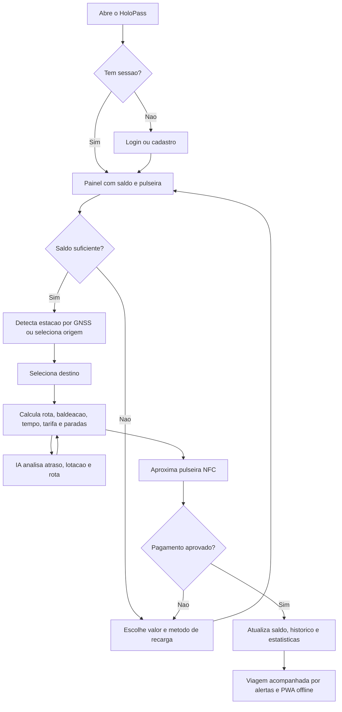

# HoloPass - Software & Total Experience Design

**Global Solution 2026 - Industria Espacial - FIAP**  
**Autor:** Thiago Souza de Lima - RM 568732

## Sumario Executivo

O HoloPass e uma pulseira inteligente para transporte publico urbano. Ela combina pagamento por NFC, localizacao por GNSS e planejamento de rota para reduzir friccao, inseguranca e dependencia do celular durante a viagem.

A solucao atende passageiros que precisam de acesso rapido, inclusivo e seguro ao transporte. O prototipo web demonstra autenticacao, saldo, recarga, rota com baldeacao, pagamento simulado, historico, PWA offline, camada conceitual de Observacao da Terra, RA simulada e IA local para risco de atraso/lotacao.

O projeto se conecta aos ODS 9, 10 e 11: infraestrutura inteligente, reducao de desigualdades no acesso a mobilidade e cidades mais eficientes.

## Declaracao da Visao do Produto

Para passageiros urbanos que precisam viajar com seguranca e praticidade, o HoloPass e uma pulseira de transporte inteligente que substitui cartao/celular na catraca, detecta a estacao por GNSS e orienta a rota em tempo real. Diferente de apps dependentes do smartphone, o HoloPass centraliza pagamento, localizacao e alertas em um dispositivo vestivel simples, acessivel e preparado para operacao offline.

## Backlog Priorizado

1. Como passageiro, quero pagar por NFC na catraca para embarcar sem tirar celular ou cartao do bolso.
2. Como passageiro, quero detectar automaticamente minha estacao por GNSS para iniciar a rota com menos cliques.
3. Como passageiro, quero calcular origem, destino, tempo, tarifa e baldeacoes para planejar a viagem.
4. Como passageiro, quero recarregar saldo por PIX, cartao ou debito para manter a pulseira pronta para uso.
5. Como passageiro, quero consultar historico e estatisticas para acompanhar gastos e viagens.
6. Como usuario com conectividade limitada, quero que o app funcione offline como PWA para acessar informacoes essenciais.
7. Como operador publico, quero visualizar uma camada conceitual de areas mal atendidas para apoiar decisoes de mobilidade.
8. Como passageiro em estacao cheia, quero sugestoes de IA sobre atraso, lotacao e rota para evitar atrasos.

## User Flow

## Criterios de Aceite da Experiencia

- O usuario consegue entrar, recarregar, calcular rota, pagar e ver historico sem erro de console.
- O app informa claramente quando esta fora do horario de operacao, mas ainda permite planejar rota.
- Todas as imagens possuem texto alternativo e a interface responde em mobile, tablet e desktop.
- A camada de Observacao da Terra e rotulada como demo conceitual, sem inventar dado satelital real.
- A navegacao principal funciona por teclado e possui foco visivel.

